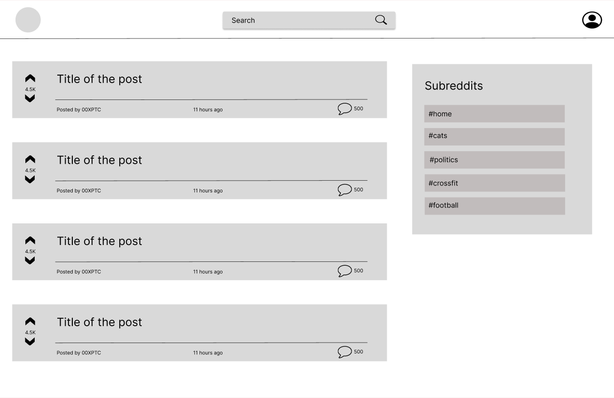

# Reddit App

## Project description

For this project, you will build an application for Reddit using everything you’ve learned, including React and Redux.
Reddit is a website where people share links to articles, media and other things on the web. The Reddit API provides
data which you will integrate into your application. The application will allow users to view and search posts and
comments provided by the API.

## Project requirements

- Build the application using React and Redux
- Version control your application with Git and host the repository on GitHub
- Write unit tests for your components using Jest and Enzyme
- Write end-to-end tests for your application using Cypress
- Users can use the application on any device (desktop to mobile)
- Users can use the application on any modern browser
- Users can access your application at a URL
- Users see an initial view of the data when first visiting the app
- Users can search the data using terms
- Users can filter the data based on categories that are predefined
- Users are shown a detailed view (modal or new page/route) when they select an item
- Users are delighted with a cohesive design system
- Users are delighted with animations and transitions
- Users are able to leave an error state

## Wireframe

